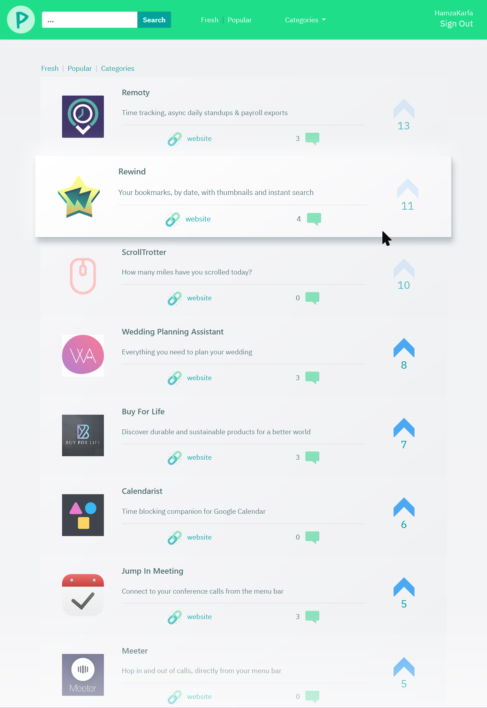
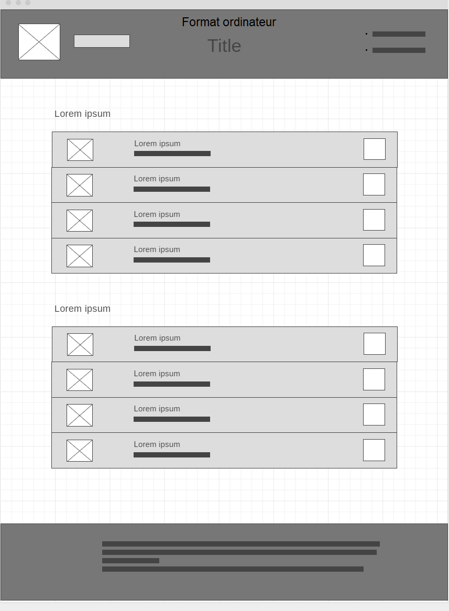
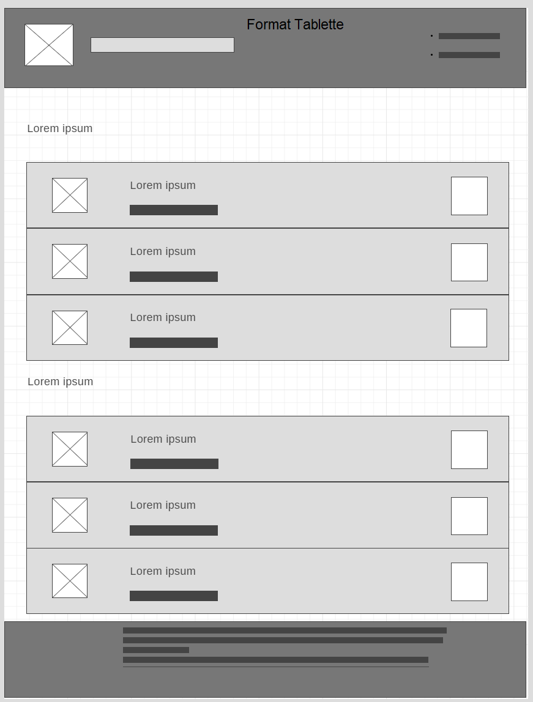
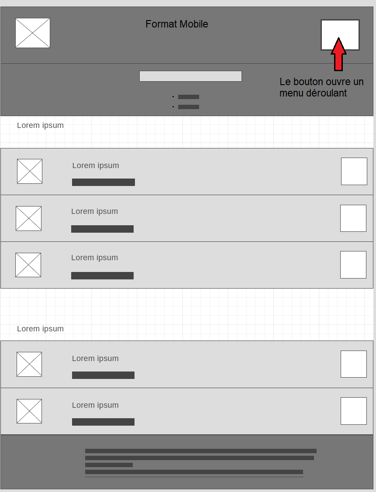

# tp product-hunt

### [live website](http://emjjjpl.cluster029.hosting.ovh.net/)

## installation

1. Clone this repository

   ```shell
   git clone --depth=1 https://github.com/pozorfluo/simplon-tp-product-hunt.git
   ```

1. Setup the database with :

   ```
   htdocs/resources/sql/tp_product_hunt.sql
   ```

   If this fails for your setup, use the following for improved compatibility :

   ```
   htdocs/resources/sql/tp_product_hunt_bootstrap.sql
   ```

   _( note : this will bootstrap the database with test data )_

1. In index.php, change DEV_FORCE_CONFIG_UPDATE to true
   ```php
   define('DEV_FORCE_CONFIG_UPDATE', true);
   ```
1. Navigate to index.php in your environment
   - A .env file is created with a skeleton config for this app.
   - Update the default db configuration in .env to match your environment.
     e.g.,
   ```json
     "db_configs": {
       "product_hunt": {
       "DB_DRIVER": "mysql",
       "DB_HOST": "127.0.0.1",
       "DB_PORT": "3306",
       "DB_CHARSET": "utf8mb4",
       "DB_NAME": "tp_product_hunt",
       "DB_USER": "your_user_name",
       "DB_PASSWORD": "your_db_password"
       }
   ```
1. Navigate to index.php



## docs

### [RESTish ProductHuntAPI](https://pozorfluo.github.io/simplon-tp-product-hunt/htdocs/docs/classes/Controllers-ProductHuntAPI.html)

#### [server side ProductHuntAPI](https://pozorfluo.github.io/simplon-tp-product-hunt/htdocs/docs/classes/Models-ProductHuntAPI.html)

## 


## db setup


## wireframes

### desktop/laptop



### tablet



### mobile



## todo

see [board on Trello](https://trello.com/b/d41FFxTW/product-hunt)

## decisions log

- Follow PSR-1 and PSR-12 coding standards.
- Separate backend API and backend dynamic page generation.
  - Backend API MUST use strict typing.
  - Backend dynamic page generation SHOULD use strict typing.
  - Backend dynamic page generation MUST NOT interact directly with the
    database and MUST use the backend API to get its data.
  - The App MAY use a single point of entry and a dispatcher to route
    requests.
- Use Ajax requests directed at the backend API to update page on the client
  and display modals.
- Use Bootstrap to build layout and style pages.

## reference links

https://api.producthunt.com/v2/docs  
https://ph-graph-api-explorer.herokuapp.com/  
http://api-v2-docs.producthunt.com.s3-website-us-east-1.amazonaws.com/operation/query/  
https://github.com/producthunt/producthunt-api  
https://graphql.org/learn/serving-over-http/
