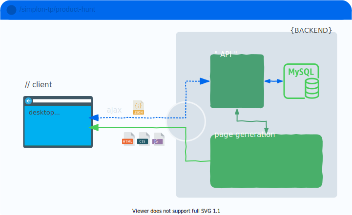
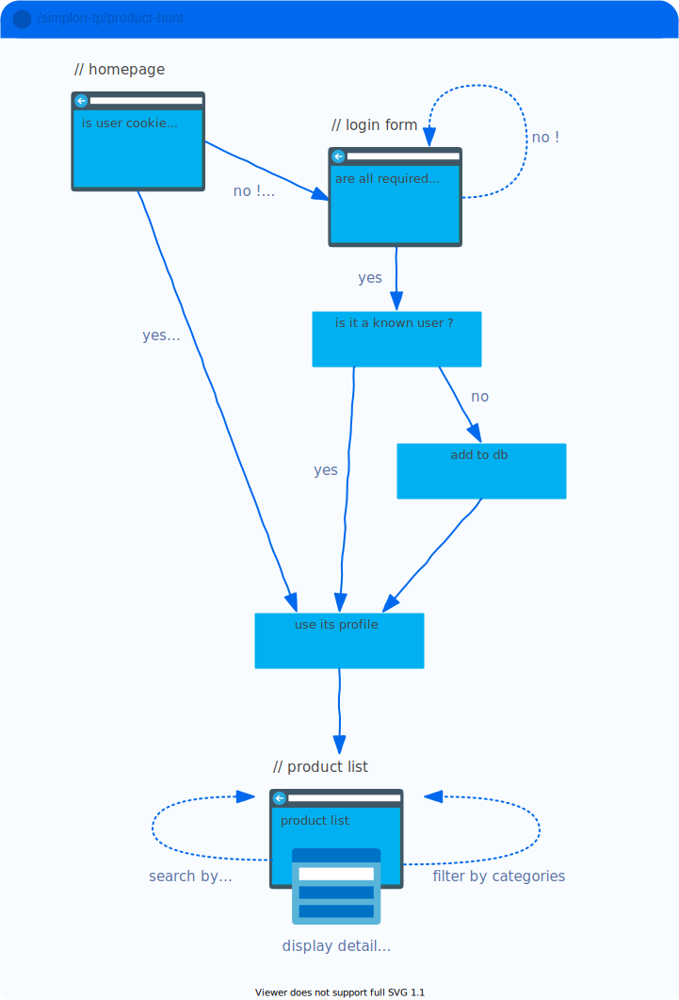
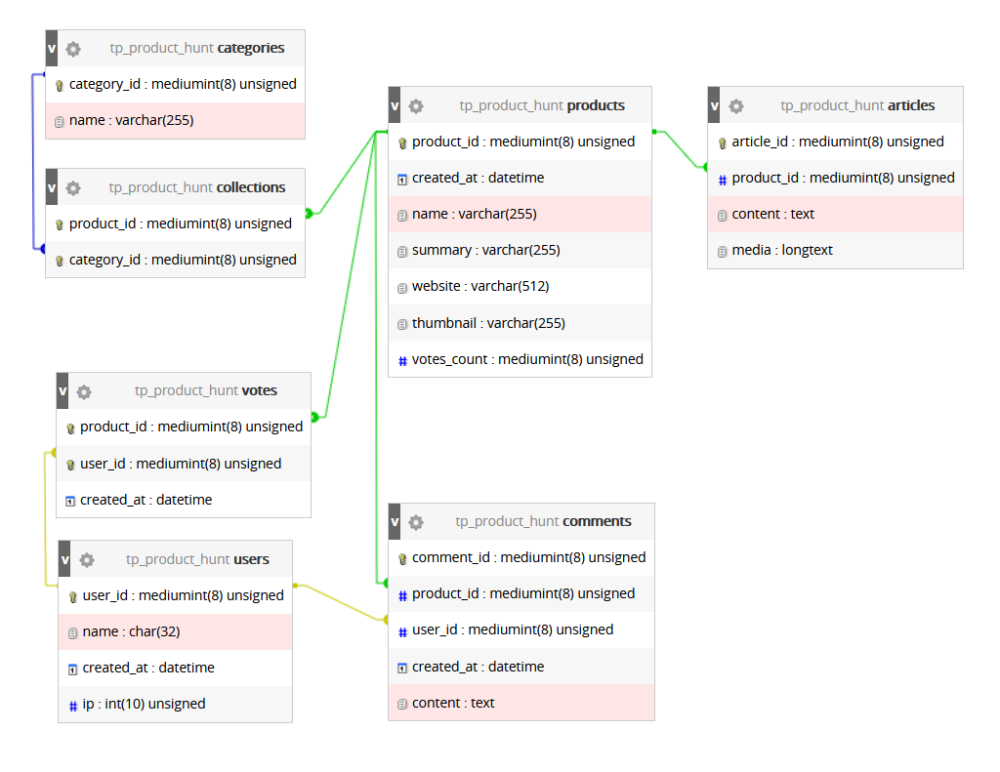

# tp product-hunt

## 

## 

## docs
[wip](https://pozorfluo.github.io/simplon-tp-product-hunt/htdocs/docs/)

## todo

see [board on Trello](https://trello.com/b/d41FFxTW/product-hunt)

## decisions log

- Follow PSR-1 and PSR-12 coding standards.
- Separate backend API and backend dynamic page generation.
  - Backend API MUST use strict typing.
  - Backend dynamic page generation SHOULD use strict typing.
  - Backend dynamic page generation MUST NOT interact directly with the
    database and MUST use the backend API to get its data.
  - The App MAY use a single point of entry and a dispatcher to route
    requests.
- Use Ajax requests directed at the backend API to update page on the client
  and display modals.
- Use Bootstrap to build layout and style pages.

## db setup wip

## reference links

https://api.producthunt.com/v2/docs  
https://ph-graph-api-explorer.herokuapp.com/  
http://api-v2-docs.producthunt.com.s3-website-us-east-1.amazonaws.com/operation/query/  
https://github.com/producthunt/producthunt-api  
https://graphql.org/learn/serving-over-http/

